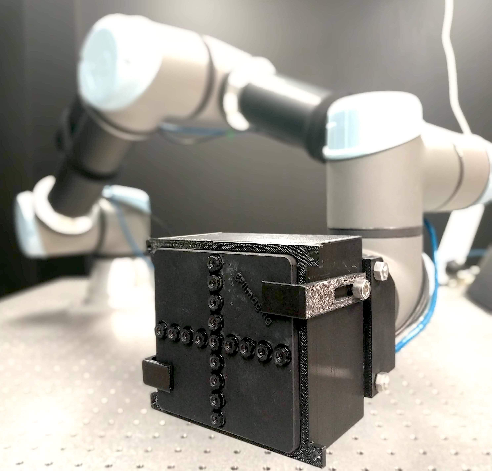

# Unsupervised learning of depth and visual odometry from light fields



This thesis project proposes a data-driven, unsupervised framework for performing visual odometry, using multi-view imaging devices. In these experiments, a camera with 17 sub-apertures arranged in a cross-hair formation was used. The cameras are indexed as shown:

```
              0   
              1
              2
              3
  4  5  6  7  8  9  10 11 12 
              13               z
              14              /
              15             /_____ x   
              16             | 
                             | 
                             y
```

While the device in this case is equipped with 17 imagers, the proposed framework works with any number of cameras, including monocular imagery. The scripts used for training in this thesis project are provided in ```training_scripts```, and includes scripts for training on monocular and trinocular imagery, all imagers in the *SU* plane (horizontal) and the complete *SUTV* plane (the full light field). 

The approach uses two CNN's:

- *LFPoseNet*: A network that accepts two frames of a lightfield video, separated by a small amount of time and space, and aims to predict the 6 degree-of-freedom ego-motion between them.
- *LFDispNet*: A network that accepts a single light field image, and aims to produce a disparity map corresponding to the center view.

These models are defined in ```lfmodels```.

## Preparing Training Data
The directory containing the dataset needs to be organised as following:

```
├── root
│    ├── seq1                              
│    │    ├── 0                             
│    │    │    ├── 000000.png                
│    │    │    ├── 000001.png            
│    │    │    ├── ...
│    │    │    └── 000372.png
│    │    ├── 1         
│    │    │    ├──000000.png
│    │    │    ├──000001.png
│    │    │    ├── ...
│    │    │    └── 000372.png
│    │    ├── ...
│    │    ├── 16
│    │    ├── poses_gt_absolute.npy         
│    │    └── poses_gt_relative.npy         
│    └── seqN
├── train.txt
└── val.txt
```

- ```poses_gt_absolute.npy```: serialised numpy array with ground truth pose data (in absolute pose, i.e. relative to origin)
-  ```poses_gt_relative.npy```: same, with relative poses, relative to the previous frame.
- ```train.txt```: names of sequences to train on, each on new line
- ```val.txt```: validation sequences
## Training

When a training script is run, outputs are generated in ```~/Documents/checkpoints/EXPERIMENT_NAME```. The outputs are: 
- ```dispnet_best.pth.tar```: best scoring dispnet model
- ```posenet_best.pth.tar```: best scoring posenet model
- ```config.txt``` and ```config.pkl```: human and machine readable configuration files containing parameters used for training. ```config.pkl``` is loaded during inference to initialise the networks with the same parameters.
- Progress logs in csv format
- Some tensorboard logs for visualisation


#### Monocular
```
sh training-scripts/train-monocular.sh
```

#### Trinocular
```
sh training-scripts/train-trinocular.sh
```

#### Horizontal Imagers
```
sh training-scripts/train-horizontal.sh
```

#### Training Arguments
```
usage: train.py [-h] [--save-path PATH] [--sequence-length N]
                [--rotation-mode] [--padding-mode]
                [-j] [--epochs] [-b] [--lr] [--momentum] [--beta]
                [--weight-decay] [--print-freq] [--pretrained-disp]
                [--pretrained-exppose] [--seed] [--log-summary]
                [--log-full] [-p] [-m] [-s] [-g] [--log-output]
                [-f] [-c] [--gray]
                DIR NAME


positional arguments:
  DIR                   path to dataset
  NAME                  experiment name

optional arguments:
  -h                    show this help message and exit
  -b                    mini-batch size 
  -c                    list of cameras to use
  -f                    frequency for outputting dispnet outputs
  -g                    weight for ground truth pose supervision loss
  -j                    number of data loading workers 
  -m                    weight for explainabilty mask loss 
  -p                    weight for photometric loss 
  -s                    weight for disparity smoothness loss   
  --lr                  initial learning rate 
  --save-path           where to save outputs
  --sequence-length     sequence length for training 
  --rotation-mode       rotation mode for PoseExpnet 
  --padding-mode        padding mode for image warping 
  --epochs              number of total epochs to run
  --momentum            momentum for sgd, alpha parameter for adam 
  --beta                beta parameters for adam 
  --weight-decay        weight decay 
  --print-freq          print frequency 
  --pretrained-disp     path to pre-trained dispnet model 
  --pretrained-exppose  path to pre-trained Exp Pose net model
  --seed                seed for random functions
  --log-summary         csv where to save per-epoch train and valid stats
  --log-full            csv where to save per-gradient descent train stats
  --log-output          will log dispnet outputs at validation
  --gray                images are grayscale 
  
  

```

## Inference

Inference requires a 'config.pkl' file that was generated during training. This file contains the training parameters such as which cameras were used, whether images are grayscale, etc.

Inference generates both disparity maps and pose predictions.  Disparity maps are saved as pngs in the the same directory as the model weights, in a new directory with the same name as the sequence. Inside there will also be a 'poses.npy' pickling of a numpy array with columns [tx, ty, tz, rx, ry, rz]. 

```
python3 infer.py --config PATH/TO/config.pkl --seq SEQUENCE_NAME
```


## Evaluation

Use evaluation.ipynb for evaluating.